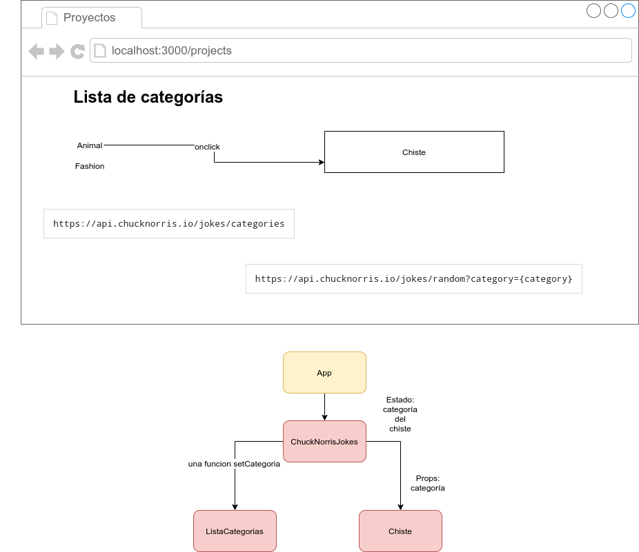

# Ejercicio de Repaso 

Crear una página con chistes de Chuck Norris, que al pulsar una categoría, nos de un chiste aleatorio de dicha categoría. 

Para ello usaremos la api de Chistes de Chuck Norris que podemos encontrar [aquí](https://api.chucknorris.io/)

El objetivo es que los componentes se hablen entre ellos. 

Por lo tanto tendremos un componente de control **ChuckNorrisJokes** que mantendrá el estado de la *categoría seleccionada*, por lo tanto necesitará este componente de una función para cambiar la categoría, que pueda ser llamado desde la lista de categorías (por lo que deberemos pasar la función como propiedad a dicha lista)

Tras esto, el chiste recuperará la categoría seleccionada (del estado de **ChuckNorrisJokes**) y solicitará a la api un chiste aleatorio. 

Posibles mejoras:

- Poner un buscador de palabras
- Guardar el chiste (los chistes se podrían guardar en un json-server, por ejemplo). Necesitaríamos una página y un Router para mostrar los chistes guardados.
- Crear un pdf con los chistes guardados. Elemento de creación de pdf [aquí](https://react-pdf.org/)

## Teoria: control de hijos a padres

Si qqueremos ejecutar desde  un  componente hijo un afunció que está definida en el padre, esta se le ha de pasar como una prop